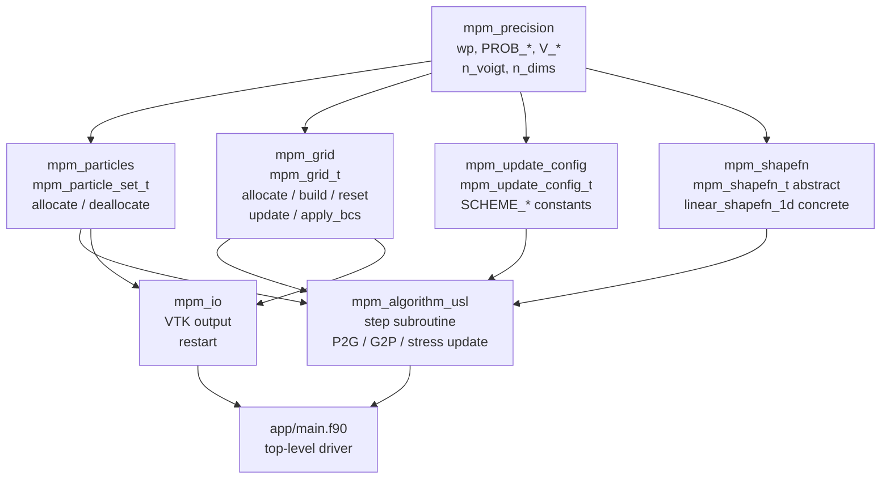

# mpm_grid Design Notes

Design, pseudocode, and algorithm flowchart for the grid module and the
full MPM time loop.

---

## Grid Type — Pseudocode

```fortran
module mpm_grid

   type :: mpm_grid_t

      ! --- configuration ---
      integer  :: n_nodes          ! total nodes
      integer  :: n_cells          ! total cells
      integer  :: ndim             ! spatial dimension
      integer  :: npc              ! nodes per cell (2 / 4 / 8)
      real(wp) :: dx               ! uniform cell size [m]
      real(wp) :: x_min            ! domain lower bound [m]
      real(wp) :: x_max            ! domain upper bound [m]

      ! --- geometry (fixed after build) ---
      real(wp), allocatable :: xI(:,:)           ! nodal positions (ndim, n_nodes)
      integer,  allocatable :: cell_nodes(:,:)   ! connectivity (npc, n_cells)

      ! --- nodal fields (zeroed each step by reset_grid) ---
      real(wp), allocatable :: mass_I(:)         ! nodal mass     [kg]      (n_nodes)
      real(wp), allocatable :: momentum_I(:,:)   ! nodal momentum [kg·m/s]  (ndim, n_nodes)
      real(wp), allocatable :: force_I(:,:)      ! nodal force    [N]       (ndim, n_nodes)
      real(wp), allocatable :: vel_I(:,:)        ! nodal velocity [m/s]     (ndim, n_nodes)
      real(wp), allocatable :: dv_I(:,:)         ! velocity increment [m/s] (ndim, n_nodes)
                                                 ! = vel_I^{n+1} - vel_I^n; used by FLIP G2P

      ! --- boundary conditions ---
      logical, allocatable :: fixed_dof(:,:)     ! fixed degree of freedom  (ndim, n_nodes)
                                                 ! .true. → zero force and momentum here

   end type mpm_grid_t

end module mpm_grid
```

---

## Key Operations — Pseudocode

### nodes_per_cell

```fortran
pure function nodes_per_cell(problem_type) result(npc)
   ! 1D → 2,  2D plane strain → 4,  3D → 8
   integer, intent(in) :: problem_type
   integer :: npc
   select case (problem_type)
      case (PROB_1D)             ; npc = 2
      case (PROB_2D_PLANE_STRAIN); npc = 4
      case (PROB_3D)             ; npc = 8
      case default               ; npc = -1
   end select
end function
```

### allocate_grid

```fortran
subroutine allocate_grid(grid, n_cells, problem_type)
   ! Derives n_nodes, ndim, npc from n_cells and problem_type.
   ! All nodal field arrays initialised to zero.
   ! fixed_dof initialised to .false. (all free).
   type(mpm_grid_t), intent(out) :: grid
   integer,          intent(in)  :: n_cells
   integer,          intent(in)  :: problem_type

   grid%n_cells = n_cells
   grid%ndim    = n_dims(problem_type)
   grid%npc     = nodes_per_cell(problem_type)

   ! 1D: n_nodes = n_cells + 1
   ! 2D: n_nodes = (n_cells_x+1) * (n_cells_y+1)  [future]
   ! 3D: similarly                                  [future]
   grid%n_nodes = n_cells + 1   ! 1D for now

   allocate(grid%xI(grid%ndim, grid%n_nodes),             source=0.0_wp)
   allocate(grid%cell_nodes(grid%npc, grid%n_cells),      source=0)
   allocate(grid%mass_I(grid%n_nodes),                    source=0.0_wp)
   allocate(grid%momentum_I(grid%ndim, grid%n_nodes),     source=0.0_wp)
   allocate(grid%force_I(grid%ndim, grid%n_nodes),        source=0.0_wp)
   allocate(grid%vel_I(grid%ndim, grid%n_nodes),          source=0.0_wp)
   allocate(grid%dv_I(grid%ndim, grid%n_nodes),           source=0.0_wp)
   allocate(grid%fixed_dof(grid%ndim, grid%n_nodes),      source=.false.)
end subroutine
```

### build_regular_grid_1d

```fortran
subroutine build_regular_grid_1d(grid, x_min, x_max, n_cells)
   ! Fill xI and cell_nodes for a uniform 1D mesh.
   ! node i sits at x_min + (i-1)*dx
   ! cell c connects nodes [c, c+1]
   type(mpm_grid_t), intent(inout) :: grid
   real(wp),         intent(in)    :: x_min, x_max
   integer,          intent(in)    :: n_cells

   integer  :: i, c
   real(wp) :: dx

   dx = (x_max - x_min) / real(n_cells, wp)

   grid%dx    = dx
   grid%x_min = x_min
   grid%x_max = x_max

   do i = 1, grid%n_nodes
      grid%xI(1, i) = x_min + (i - 1) * dx
   end do

   do c = 1, n_cells
      grid%cell_nodes(1, c) = c
      grid%cell_nodes(2, c) = c + 1
   end do
end subroutine
```

### reset_grid

```fortran
subroutine reset_grid(grid)
   ! Zero all nodal fields. Called at the start of every time step.
   ! Does NOT touch xI, cell_nodes, fixed_dof, or geometry scalars.
   type(mpm_grid_t), intent(inout) :: grid
   grid%mass_I     = 0.0_wp
   grid%momentum_I = 0.0_wp
   grid%force_I    = 0.0_wp
   grid%vel_I      = 0.0_wp
   grid%dv_I       = 0.0_wp
end subroutine
```

### apply_bcs

```fortran
subroutine apply_bcs(grid)
   ! Zero force and momentum on fixed degrees of freedom.
   ! Called twice per step: once before and once after the momentum update.
   type(mpm_grid_t), intent(inout) :: grid
   integer :: i, n
   do n = 1, grid%n_nodes
      do i = 1, grid%ndim
         if (grid%fixed_dof(i, n)) then
            grid%force_I(i, n)    = 0.0_wp
            grid%momentum_I(i, n) = 0.0_wp
         end if
      end do
   end do
end subroutine
```

### update_grid (momentum solve)

```fortran
subroutine update_grid(grid, dt)
   ! Advance nodal momentum, compute new velocity and velocity increment.
   ! vel_I_old = momentum_I / mass_I  (velocity before update)
   ! momentum_I += force_I * dt
   ! vel_I      = momentum_I / mass_I  (velocity after update)
   ! dv_I       = vel_I - vel_I_old    (used by FLIP in G2P)
   type(mpm_grid_t), intent(inout) :: grid
   real(wp),         intent(in)    :: dt

   integer  :: i, n
   real(wp) :: vel_old

   do n = 1, grid%n_nodes
      if (grid%mass_I(n) < MASS_TOL) cycle   ! skip empty nodes
      do i = 1, grid%ndim
         vel_old              = grid%momentum_I(i,n) / grid%mass_I(n)
         grid%momentum_I(i,n) = grid%momentum_I(i,n) + grid%force_I(i,n) * dt
         grid%vel_I(i,n)      = grid%momentum_I(i,n) / grid%mass_I(n)
         grid%dv_I(i,n)       = grid%vel_I(i,n) - vel_old
      end do
   end do
end subroutine
```

---

## Algorithm Flowchart

```mermaid
flowchart TD

   %% ── Initialisation ──────────────────────────────────────────
   START([Start]) --> INIT_INPUT[Read problem parameters\nproblem_type, n_cells, n_mp,\nx_min/x_max, E, rho, t_end, alpha]

   INIT_INPUT --> ALLOC_GRID[allocate_grid\ngrid: xI, cell_nodes,\nmass_I, momentum_I,\nforce_I, vel_I, dv_I,\nfixed_dof]

   INIT_INPUT --> ALLOC_PART[allocate_particle_set\nset: xp, vp, ap,\nmp, vol, rho,\nsig, eps, eps_p]

   INIT_INPUT --> SET_CFG[mpm_update_config_t\nscheme = SCHEME_FLIP_PIC\nalpha = 1.0  ← pure FLIP\nfor elastic wave]

   ALLOC_GRID --> BUILD[build_regular_grid_1d\nfill xI, cell_nodes\nset fixed_dof at ends]
   ALLOC_PART --> INIT_MP[Initialise particles\nxp: uniform in domain\nmp = rho * vol_cell / npc\nvol = vol_cell / npc\nsig = 0]
   SET_CFG --> TIME_LOOP

   BUILD --> TIME_LOOP
   INIT_MP --> TIME_LOOP

   %% ── Time loop ────────────────────────────────────────────────
   TIME_LOOP{t < t_end?} -- No --> OUTPUT_FINAL[Write final state\nDeallocate] --> STOP([End])
   TIME_LOOP -- Yes --> CFL[Compute stable dt\ndt = CFL_FACTOR * dx / c_wave\nc_wave = sqrt E/rho]

   %% ── USL Step ─────────────────────────────────────────────────
   CFL --> RESET[reset_grid\nzero mass_I, momentum_I\nforce_I, vel_I, dv_I]

   %% ── P2G ──────────────────────────────────────────────────────
   RESET --> P2G_LOOP[P2G loop over particles p = 1..n_mp]

   P2G_LOOP --> SF_EVAL[Evaluate shape functions\nFind host cell for xp\nCompute N_ip, dN_dx_ip\nfor 2 neighbour nodes]

   SF_EVAL --> SCATTER_MASS[Scatter mass\nmass_I_a  += N_ia * mp\nmass_I_b  += N_ib * mp]

   SCATTER_MASS --> SCATTER_MOM[Scatter momentum\nmomentum_I_a += N_ia * mp * vp\nmomentum_I_b += N_ib * mp * vp]

   SCATTER_MOM --> SCATTER_FORCE[Scatter internal force\nforce_I_a -= dN_dx_ia * sig_p * vol_p\nforce_I_b -= dN_dx_ib * sig_p * vol_p\nAdd body force: force_I += N_ip*mp*g]

   %% ── Grid solve ───────────────────────────────────────────────
   SCATTER_FORCE --> BC1[apply_bcs\nzero force and momentum\non fixed_dof nodes]

   BC1 --> GRID_UPDATE[update_grid\nvel_old = momentum_I / mass_I\nmomentum_I += force_I * dt\nvel_I  = momentum_I / mass_I\ndv_I   = vel_I - vel_old]

   GRID_UPDATE --> BC2[apply_bcs again\nzero momentum on\nfixed_dof nodes]

   %% ── G2P ──────────────────────────────────────────────────────
   BC2 --> G2P_LOOP[G2P loop over particles p = 1..n_mp]

   G2P_LOOP --> FLIP_UPDATE[alpha-FLIP velocity update\nv_flip = vp + sum N_ip * dv_I\nv_pic  = sum N_ip * vel_I\nvp_new = alpha*v_flip + 1-alpha*v_pic]

   FLIP_UPDATE --> POS_UPDATE[Update position\nxp += dt * vp_new]

   POS_UPDATE --> VGRAD[Compute velocity gradient L\nL = sum dN_dx_ip * vel_I_a\nextract D sym and W skew]

   VGRAD --> VOL_UPDATE[Update volume\nvol_p *= 1 + tr_D * dt\nUpdate density: rho_p = mp / vol_p]

   %% ── Stress update ────────────────────────────────────────────
   VOL_UPDATE --> STRESS_LOOP[Stress update loop\nover particles p = 1..n_mp]

   STRESS_LOOP --> STRAIN_INC[Strain increment\ndeps = D * dt]

   STRAIN_INC --> JAUMANN[Jaumann correction\nsig_corr = sig*W - W*sig\nsig += sig_corr * dt]

   JAUMANN --> ELASTIC[Linear elastic update\nsig += stiff_e * deps\nstiff_e from E, nu]

   %% ── Advance ──────────────────────────────────────────────────
   ELASTIC --> ADVANCE[t += dt\nstep += 1]

   ADVANCE --> OUTPUT_CHECK{Output step?}
   OUTPUT_CHECK -- Yes --> WRITE_OUT[Write particle state\nVTK / CSV] --> TIME_LOOP
   OUTPUT_CHECK -- No  --> TIME_LOOP
```



---

## Module Dependency Graph



---

## Notes on the 2D / 3D Extension

When extending `mpm_grid` to 2D:

- `n_nodes` = `(n_cells_x + 1) * (n_cells_y + 1)`
- `allocate_grid` will need `n_cells_x` and `n_cells_y` (or a `grid_config_t`)
- `build_regular_grid_2d` fills `xI` as a structured quad mesh
- `cell_nodes` connectivity becomes a 4×n_cells array
- The 1D formula `n_nodes = n_cells + 1` is replaced

Consider introducing a `mpm_grid_config_t` to avoid a growing argument list:

```fortran
type :: mpm_grid_config_t
   integer  :: n_cells_x = 1
   integer  :: n_cells_y = 1    ! ignored for 1D
   integer  :: n_cells_z = 1    ! ignored for 1D / 2D
   real(wp) :: x_min = 0.0_wp
   real(wp) :: x_max = 1.0_wp
   real(wp) :: y_min = 0.0_wp   ! ignored for 1D
   real(wp) :: y_max = 1.0_wp   ! ignored for 1D
   real(wp) :: z_min = 0.0_wp   ! ignored for 1D / 2D
   real(wp) :: z_max = 1.0_wp   ! ignored for 1D / 2D
end type
```

---

## MASS_TOL Constant

`update_grid` skips nodes with `mass_I < MASS_TOL` to avoid division by zero.
This constant belongs in `mpm_precision` alongside the other physical tolerances:

```fortran
real(wp), parameter, public :: MASS_TOL = 1.0e-12_wp  ! [kg]
```
